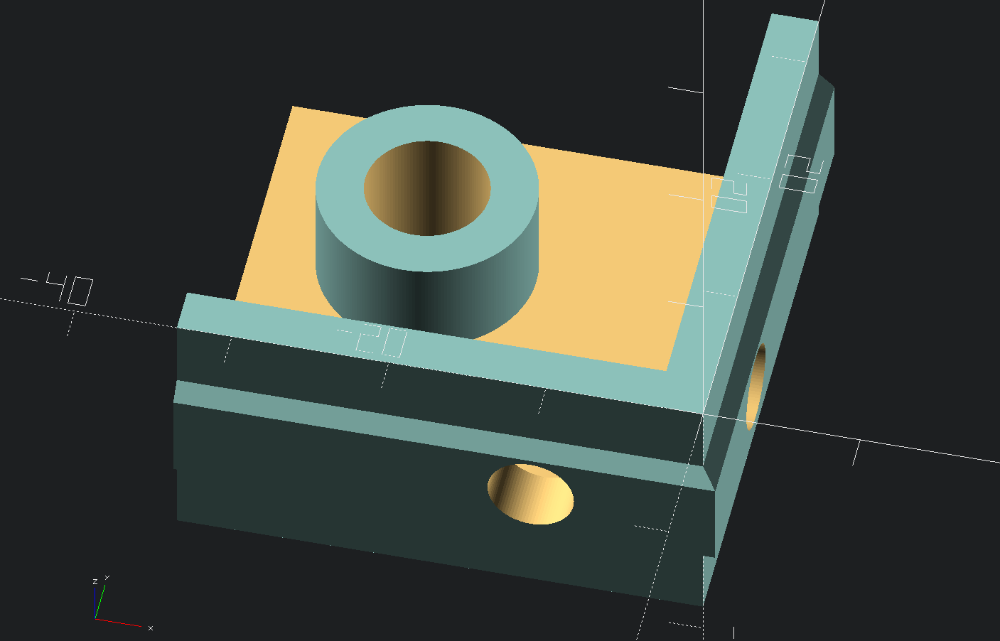
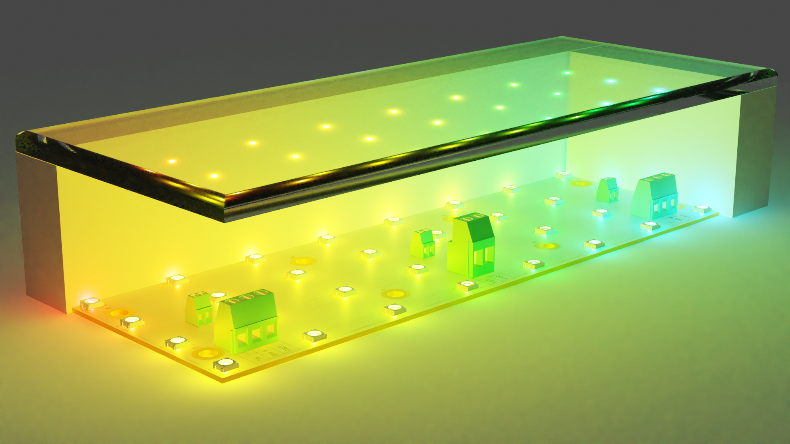
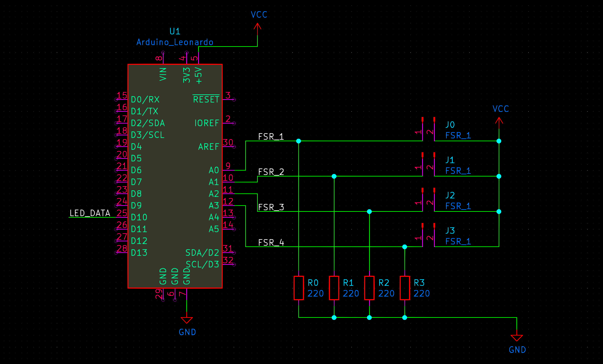
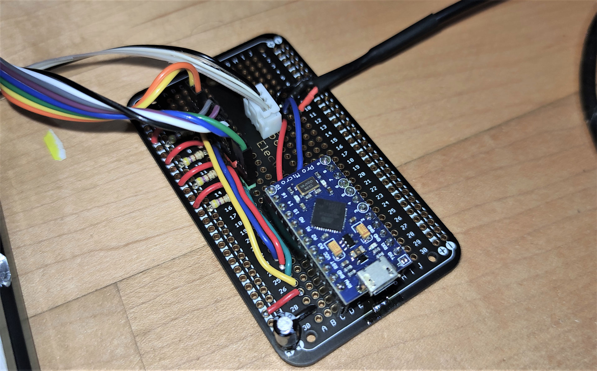
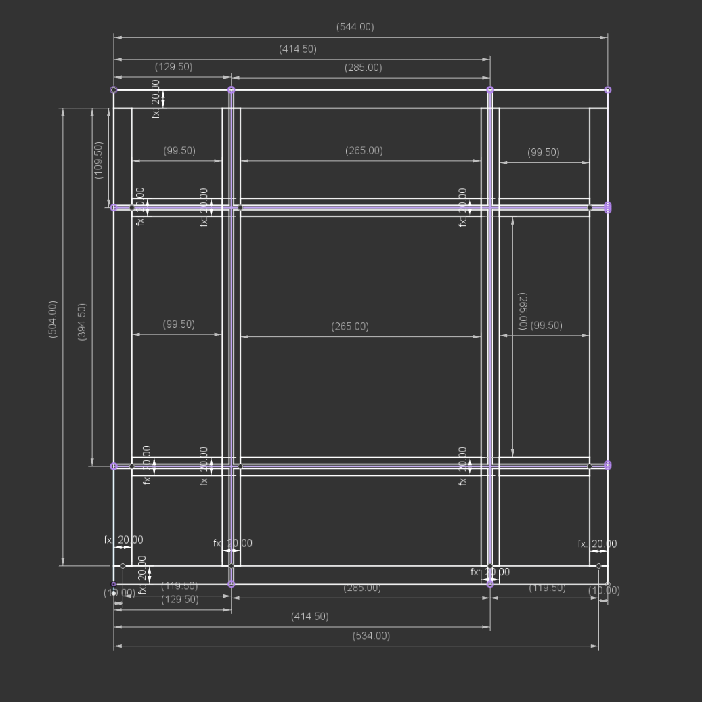

# Widgetpad v0

Hi, I'm Widget, and these are the files for my ITG dance/travel pad.

This is the "v0" version, currently in prototype status. I don't plan
on deviating too far from these plans, but there are more adjustments
I still want to make to make the pad easier to manufacture, easier to
fork the source code for, and have it perform more consistently.

You can find me on the Stamina Nation discord causing problems in #pads.

If you live in Chicago and can pass stamina 16's or higher, I would be
interested in having you try out the prototype in person for feedback.
Let me know on Discord.

## Motivation

Current pads either suck or are >$1000. LTEKs are acceptable but need
significant modding using custom microcontrollers and the fragile "penny
mod", so why not just make a new pad?

Currently it's mainly competing with Bandit's
[Build This Travel Pad](https://www.youtube.com/watch?v=y6wGYLE0YI4)
and [Bandit's Terrific Travel Pad](https://github.com/BanditsTerrificTravelPad/bttp)
budget designs.

## Specs

* Aluminum extrusion frame (2020 profile)
* 1/2" acrylic panels
* Arduino Pro Micro microcontroller (but with plans to switch to Teensy
  4.0)
* Force-sensitive resistors for configurable sensitivity
  * Allows for rather extreme sensitivity if made with good tolerances
* Optional LED grid PCBs (WS2812C LEDs)

## License

GNU GPL v2. See LICENSE for full text.

## Demo

## Requirements

### Materials

* Arduino Pro Micro or Teensy 2.0 or higher
* 4x 220 ohm resistors
* Some wire to extend FSR connections
* Panels, cut or precut:
  * Either
    * 4x 12mm thickness 280mm x 280mm acrylic panels (1/2" thickness
      11"x11") or larger
  * Or
    * 1x 280mm x 280mm precut acrylic center panel
    * 4x 280mm x 125mm precut acrylic side panels
    * 4x 125mm x 125mm precut acrylic corner panels (optional)
  * Optionally, acetal (a.k.a. POM, Delrin) as a slipperier center panel
    instead of acrylic
* Aluminum extrusion (2020 profile)
  * All taps should be M6 taps with 10mm depth
    * Extra depth is acceptable but may require longer M6 threaded rods
  * 2x 544mm extrusions
    * Drill 6mm at holes at 10mm, 129.5mm, 414.5mm, and 534mm
    * Countersink these holes for your 6mm bolts as well
  * 4x 504mm extrusions, both ends tapped
    * Drill 6mm holes at 109.5mm and 394.5mm
    * For 2 extrusions, countersink these holes for your 6mm bolts as
      well
    * For the other 2 extrusions, extra holes for wiring recommended
  * 2x 265mm extrusions, both ends tapped
    * Extra holes through the center for wiring recommended
  * 4x 99.5mm extrusions, both ends tapped
    * Extra holes through the center for wiring recommended
* Force sensitive resistors (4x 200mm [Interlink 408](https://buyinterlinkelectronics.com/collections/new-standard-force-sensors/products/fsr-model-408-200mm-length) or 8x
  [Interlink 400](https://buyinterlinkelectronics.com/collections/new-standard-force-sensors/products/fsr-model-400))
* 12x countersunk M6x30mm bolts
* 12x hex-head M6x30mm bolts
* 4x M6x40mm threaded rods
* 16x M6 threaded inserts for plastic
* 40x M5x10 bolts
* 40x M5 hammer nuts for 2020 aluminum extrusion
* An "engineering" filament for 3D printed parts, such as PETG, nylon,
  or polycarbonate
* Optional: cross brackets and angle brackets for stability
* Optional: rubber bumpers for floor safety and/or better pad sensitivity
* Optional: 128 [WS2812C-5050](https://lcsc.com/product-detail/Light-Emitting-Diodes-LED_5050-RGBIntegrated-Light-4Pin_C114587.html) LEDs for PCBs
* Optional: 8x 1x2 2.54mm-pitch right-angle male PCB headers for PCBs
* Optional: 4x [5.04mm-pitch 1x2 screw terminals](https://lcsc.com/product-detail/Screw-terminal_Ningbo-Kangnex-Elec-WJ500V-5-08-2P_C8465.html) for PCBs
* Optional: 8x [5.04mm-pitch 1x3 screw terminals](https://lcsc.com/product-detail/Screw-terminal_Ningbo-Kangnex-Elec-WJ500V-5-08-3P_C72334.html) for PCBs

### Equipment

* Table saw if acrylic cutting needed
* Drill press with 6mm (1/4") drill bit and 45° countersink bit
* Table router and roundover bit or lots of sandpaper for smooth edges
* 3mm and 4mm allen keys
* 3D printer for panel mounts
* A heated tool of some sort, such as a soldering iron or a lighter and
  a rod of some type, for inserting the threaded inserts
* Soldering iron is required if assembling PCBs
* DuPont wire crimpers may be useful for making "extension cords" for
  the FSR connectors

### 3D printed parts

3D printed parts can be found in the `3d/` folder.

Parts are designed using [OpenSCAD](https://openscad.org/) with the
[BOSL2](https://github.com/revarbat/BOSL2) library. OpenSCAD nightlies
and BOSL2 master branch are recommended.

Corner bracket mounts will need to be 3D printed to connect the panels
to the aluminum frame.

Strong filaments, at a minimum PETG but preferably
nylon or polycarbonate will be required. Brittle filaments like PLA,
ABS, HIPS, and ASA may crack. High-rigidity TPU filaments (Shore
hardness 98A or higher) may work, but soft filaments may cause the
panels to slide during play.

A soldering iron or other heating tool will be needed to melt the
threaded inserts into the 3D printed part for the panels to connect to.

PCB mounts may also be 3D printed.

A housing will eventually be designed for the microcontroller but not
as part of v0.

### PCBs

Currently only panel PCBs exist. They will be heavily redesigned in the
future but still work acceptably well in their current state.

The PCBs are designed using [KiCAD](https://www.kicad.org/).

The PCBs each hold an 8x4 grid of WS2812C LEDs. An external 5V power
source is recommended if using LEDs.

Each PCB has screw terminals for connecting the WS2812C inputs and
outputs. In addition, there are 3 positions of screw terminals and
headers for connecting one or more FSRs. Multiple FSRs would be wired
in parallel.

## Construction

### Frame

1) Cut all aluminum extrusion pieces to length, if not precut
2) Cut drills and countersinks in extrusion
3) Tap all extrusion pieces 10mm deep except the two longest ones, if
   not pretapped
4) Use threaded rods to attach small extrusions "through" the two longer
   center ones
5) Bolt the four second-longest extrusions to the longest two extrusions
6) Insert threaded inserts (using heat) into 3D printed panel mounts
7) Attach 3D printed panel mounts to corners of frame using M5 hammer
   nuts
8) Optionally add cross braces and corner brackets, and add rubber feet
   to the bottom of the frame

### Panels

1) Cut all panels to correct size
2) Preferably using a drill press, cut holes 30mm inset from each corner
   * Four holes on the center panel
   * Two adjacent holes on the edge panels
   * Two opposing holes on the corner panels
3) Use a countersink bit to countersink the holes
4) Using a table router with a roundover bit or lots of sandpaper,
   smooth the edges so that your socks don't get torn up

### Wiring

This pad uses typical wiring for FSR-based pads. Each FSR should connect
to an analog pin an the microcontroller with a 220 ohm pulldown resistor
with the other side connected to VCC.

LED boards will need a connection to VCC, GND, and a data pin, typically
D10 on the Arduino Pro Micro.

An external 5V power source is recommended if using LEDs.

One or more large capacitors (47μF or larger) across +5V and GND may
help with signal stability if the LEDs are causing noise in the FSR
signals.

See also [this diagram](https://cdn.discordapp.com/attachments/591851159795400734/841802090543054849/Untitled-1.png) by Bandit.

## Dimensions

The dimensions are currently calculated using Fusion 360, but I hate
Fusion 360 so eventually I'll change it over to OpenSCAD as well.

## Firmware

The firmware is still a work in progress and can be found at
[widget-/bttp-firmware](https://github.com/widget-/bttp-firmware). It is
a fork of Bandit's [BTTP](https://github.com/BanditsTerrificTravelPad/bttp)
pad's firmware.

Currently it supports joystick or keyboard input, and allows an arbitrary
amount of buttons with corresponding optional LED strips. Sensitivity
can be adjusted either in the firmware or with a tool such as the
[bttp-config-tool](https://github.com/BanditsTerrificTravelPad/bttp-config-tool).

## Special thanks

* Bandit, for motivating me to make this pad, as well as giving me one
  of his prototype pads to play on.
* [dominick](https://www.youtube.com/channel/UCpeNRVOVrqx_lras7hbOOrQ)
  and [teejusb](https://github.com/teejusb) for their help and experience
* The rest of #pads for keeping me motivated
* [South Side Hackerspace](https://sshchicago.org/), for having all the equipment used to create
  the prototype
