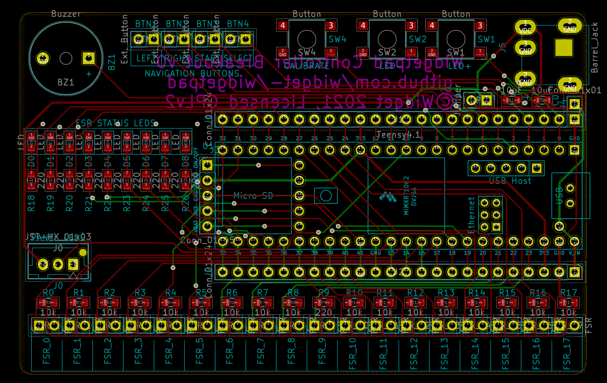
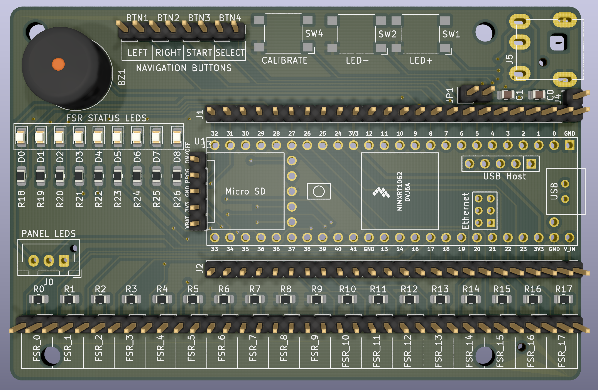

# Teensy 4.0/4.1 Breakout PCB

This is a breakout board for the Teensy 4.0 or Teensy 4.1
microcontroller, intended for use with custom dance pads for games like
ITG and Pump It Up.

This PCB is designed in KiCAD. If the dependencies for the board are not
detected automatically, add the common_lib folder next to this folder
to your KiCAD's search paths for both libraries and footprints.

## Features

* Many FSR outputs with 10kΩ resistors
  * 18 outputs with Teensy 4.1
  * 10 outputs with Teensy 4.0
* Status LEDs for FSR activation status
* 3-pin JST-XH connector for WS2811/WS2812 panel LED boards or strips
* Internal buttons for controlling LED brightness and activating pad
  automatic calibration
* Connection points for external navigation buttons
* Buzzer for audio feedback
* DC barrel jack connector for external LED power
  * Jumper for using USB power to power LEDs instead
* Headers for all soldered Teensy pins, to allow for use cases beyond
  just this board

## License

GNU GPL v2. See the LICENSE file in this project's root for full text.

## Schematic

